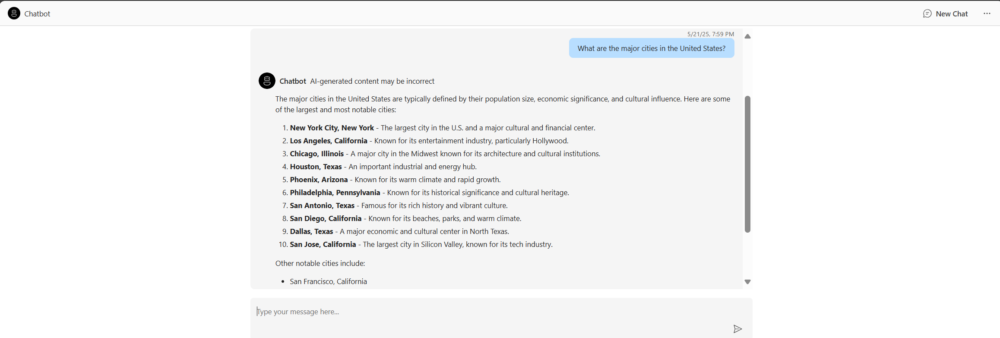

<!-- YAML front-matter schema: https://review.learn.microsoft.com/en-us/help/contribute/samples/process/onboarding?branch=main#supported-metadata-fields-for-readmemd -->

# Get Started with Chat Using Azure AI Foundry

MENU: [**FEATURES**](#features) \| [**GETTING STARTED**](#getting-started) \| [**CONFIGURE YOUR ENVIRONMENT**](#configure-your-environment)  \| [**DEPLOYMENT**](#deployment)  \| [**RESOURCE CLEAN-UP**](#resource-clean-up) \| [**TRACING AND MONITORING**](#tracing-and-monitoring) \| [**GUIDANCE**](#guidance) 

This solution contains a simple chat application that is deployed to Azure Container Apps. There are instructions for deployment through GitHub Codespaces, VS Code Dev Containers, and your local development environment.

## Important Security Notice

This template, the application code and configuration it contains, has been built to showcase Microsoft Azure specific services and tools. We strongly advise our customers not to make this code part of their production environments without implementing or enabling additional security features.  

For a more comprehensive list of best practices and security recommendations for Intelligent Applications, [visit our official documentation](https://learn.microsoft.com/en-us/azure/ai-foundry/).

## Features

This solution creates an Azure AI Foundry hub, project and connected resources including Azure AI Services, AI Search and more. Here is a screenshot:


More details about the resources can be found in the [resources](#resources) documentation. There are options to enable Retrieval-Augmented Generation (RAG) and use logging, tracing, and monitoring. 

#### Architecture diagram


The app code runs in Azure Container apps to process the user input and generate a response to the user. It leverages Azure AI projects and Azure AI services, including the model and search service.
        
## Getting Started

### Quick Deploy

| [](https://codespaces.new/Azure-Samples/get-started-with-ai-chat) | [](https://vscode.dev/redirect?url=vscode://ms-vscode-remote.remote-containers/cloneInVolume?url=https://github.com/Azure-Samples/get-started-with-ai-chat) |
|---|---|

Github Codespaces and Dev Containers both allow you to download and deploy the code for development. You can also continue with local development. Once you have selected your environment, follow the instructions below to customize and deploy your solution.       

### Prerequisites

#### Azure account
If you do not have an Azure Subscription, you can sign up for a [free Azure account](https://azure.microsoft.com/free/) and create an Azure Subscription.

To deploy this Azure environment successfully, your Azure account (the account you authenticate with) must have the following permissions and prerequisites on the targeted Azure Subscription:

- **Microsoft.Authorization/roleAssignments/write** permissions at the subscription scope.  
  _(typically included if you have [Role Based Access Control Administrator](https://learn.microsoft.com/azure/role-based-access-control/built-in-roles#role-based-access-control-administrator-preview), [User Access Administrator](https://learn.microsoft.com/azure/role-based-access-control/built-in-roles#user-access-administrator), or [Owner](https://learn.microsoft.com/azure/role-based-access-control/built-in-roles#owner) role)_
- **Microsoft.Resources/deployments/write** permissions at the subscription scope.

You can view the permissions for your account and subscription by going to Azure portal, clicking 'Subscriptions' under 'Navigation' and then choosing your subscription from the list. If you try to search for your subscription and it does not come up, make sure no filters are selected. After selecting your subscription, select 'Access control (IAM)' and you can see the roles that are assigned to your account for this subscription. If you want to see more information about the roles, you can go to the 'Role assignments' tab and search by your account name and then click the role you want to view more information about.

Additionally the following are required for successful deployment:

- **Sufficient quotas** available to deploy the selected chat and embedding model.
- **Regional availability**: The chosen model must be available in the Azure region where your Azure AI Foundry environment is created. [Verify region availability here.](https://learn.microsoft.com/azure/ai-services/openai/concepts/models?tabs=global-standard%2Cstandard-embeddings#model-summary-table-and-region-availability)

#### Required tools
Make sure the following tools are installed:

1. [Azure Developer CLI (azd)](https://aka.ms/install-azd) Install or update to the latest version. Instructions can be found on the linked page.
2. [Python 3.9+](https://www.python.org/downloads/)
3. [Git](https://git-scm.com/downloads)
4. [Docker Desktop](https://www.docker.com/products/docker-desktop/)
5. \[Windows Only\] [PowerShell](https://learn.microsoft.com/powershell/scripting/install/installing-powershell-on-windows) of the latest version, needed only for local application development on Windows operation system. Please make sure that PowerShell executable `pwsh.exe` is added to the `PATH` variable.

## Configure your Environment

This section details the customizable options for this solution, including chat model, knowledge retrieval, logging, tracing, and quota recommendations. If you want to proceed with the default settings, continue to the [deployment section](#deployment). 

#### Code
If you are using one of the [Quick Deploy options](#quick-deploy), open the codespace now. 

If you are not using any of the Quick Deploy options, download the project code:

```shell
git clone https://github.com/Azure-Samples/get-started-with-ai-chat.git
```
At this point you could make changes to the code if required. However, no changes are needed to deploy and test the app as shown in the next step.

#### Logging
To enable logging to a file, navigate to `src/Dockerfile` and edit the code to uncomment the following line:

 ```code
 # ENV APP_LOG_FILE=app.log
 ```

 By default the file name app.log is used. You can provide your own file name by replacing app.log with the desired log file name.

 **NOTE!** Any changes to the Dockerfile require a re-deployment in order for the changes to take effect.

The provided file logging implementation is intended for development purposes only, specifically for testing with a single client/worker. It should not be used in production environments after the R&D phase.

#### Tracing to Azure Monitor
To enable tracing to Azure Monitor, add the following to the `.env` file:
```code
ENABLE_AZURE_MONITOR_TRACING=true
```
Note that the optional App Insights resource is required for tracing to Azure Monitor (it is created by default).

To enable message contents to be included in the traces,add the following to the `.env` file. Note that the messages may contain personally identifiable information.

```code
AZURE_TRACING_GEN_AI_CONTENT_RECORDING_ENABLED=true
```

#### Configurable Deployment Settings
When you start a deployment, most parameters will have default values. You can change the following default settings: 

| **Setting** | **Description** |  **Default value** |
|------------|----------------|  ------------|
| **Existing AI Project Resource ID** | Specify an existing AI Project resource ID to be used instead of provisioning new resources. |   |
| **Azure Region** | Select a region with quota which supports your selected model. |   |
| **Model** | Choose from the [list of models supported by Azure AI Agent Service](https://learn.microsoft.com/azure/ai-services/agents/concepts/model-region-support) for your selected region | gpt-4o-mini |  
| **Model Format** | Choose from OpenAI or Microsoft, depending on your model | OpenAI |  
| **Model Deployment Capacity** | Configure capacity for your model. Recommended value is 100k. | 30k |
| **Embedding Model** | Choose from text-embedding-3-large, text-embedding-3-small, and text-embedding-ada-002. |  text-embedding-3-small |
| **Embedding Model Capacity** | Configure capacity for your embedding model. |  30k |

For a detailed description of customizable fields and instructions, view the [deployment customization guide](docs/deploy_customization.md).

#### Quota Recommendations

The default for the model capacity in deployment is 30k tokens. For optimal performance, it is recommended to increase to 100k tokens. You can change the capacity by following the steps in [setting capacity and deployment SKU](docs/deploy_customization.md#customizing-model-deployments).

* Navigate to the home screen of the [Azure AI Foundry Portal](https://ai.azure.com/).
* Select Quota Management buttom at the bottom of the home screen.
* In the Quota tab, click the GlobalStandard dropdown and select the model and region you are using for this accelerator to see your available quota. Please note gpt-4o-mini and text-embedding-ada-002 are used as default.
* Request more quota or delete any unused model deployments as needed.

#### Retrieval-Augmented Generation (RAG)
 
The Retrieval-Augmented Generation (RAG) feature helps improve the responses from your application by combining the power of large language models (LLMs) with extra context retrieved from an external data source. Simply put, when you ask a question, the application first searches through a set of relevant documents (stored as embeddings) and then uses this context to provide a more accurate and relevant response. If no relevant context is found, the application returns the LLM response directly.
 
This feature is disabled by default. To configure and enable the RAG feature in your application, please refer to the following detailed documentation:
 
**[Retrieval-Augmented Generation (RAG) Setup Guide](docs/RAG.md)**

## Deployment

### Deployment Options

Pick from the options below to see step-by-step instructions for: GitHub Codespaces, VS Code Dev Containers, and Local Environment. If you encounter an issue with any of the following options, try a different one. 

<details>
  <summary><b>GitHub Codespaces</b></summary>

#### GitHub Codespaces

You can run this template virtually by using GitHub Codespaces. The button will open a web-based VS Code instance in your browser:

1. Open the template (this may take several minutes):

    [](https://codespaces.new/Azure-Samples/get-started-with-ai-chat)

2. Open a terminal window
3. Continue with the [deploying steps](#deploying-steps)

</details>

<details>
  <summary><b>VS Code Dev Containers</b></summary>

#### VS Code Dev Containers

A related option is VS Code Dev Containers, which will open the project in your local VS Code using the [Dev Containers extension](https://marketplace.visualstudio.com/items?itemName=ms-vscode-remote.remote-containers):

1. Start Docker Desktop (install it if not already installed [Docker Desktop](https://www.docker.com/products/docker-desktop/))
2. Open the project:

    [](https://vscode.dev/redirect?url=vscode://ms-vscode-remote.remote-containers/cloneInVolume?url=https://github.com/Azure-Samples/get-started-with-ai-chat)

3. In the VS Code window that opens, once the project files show up (this may take several minutes), open a terminal window.
4. Continue with the [deploying steps](#deploying-steps)
</details>

<details>
  <summary><b>Local Environment</b></summary>

#### Local Environment

1. Confirm that you have the required tools installed from the [prerequisites](#prerequisites) section and the code downloaded from the [code](#code) section
2.  Open the project folder in your terminal or editor
3. Continue with the [deploying steps](#deploying-steps)
</details>

<details>
  <summary><b>Local Development Server</b></summary>

#### Local Development Server

You can optionally use a local development server to test app changes locally. Make sure you first [deployed the app](#deployment) to Azure by following the [deploying steps](#deploying-steps) before running the development server.

1. Create a [Python virtual environment](https://docs.python.org/3/tutorial/venv.html#creating-virtual-environments) and activate it.

    On Windows:

    ```shell
    python -m venv .venv
    .venv\scripts\activate
    ```

    On Linux:

    ```shell
    python3 -m venv .venv
    source .venv/bin/activate
    ```

2. Navigate to the `src` directory:

    ```shell
    cd src
    ```

3. Install required Python packages:

    ```shell
    python -m pip install -r requirements.txt
    ```
 
4. Install [Node.js](https://nodejs.org/) (v20 or later).

5. Navigate to the frontend directory and setup for React UI:

    ```shell
    cd src/frontend
    pnpm run setup
    ```

6. Run the local server:

    ```shell
    python -m uvicorn "api.main:create_app" --factory --reload
    ```

7. Click 'http://127.0.0.1:8000' in the terminal, which should open a new tab in the browser.

8.  Enter your message in the box.

(Optional) if you have changes in `src/frontend`, execute:

    ```shell
    pnpm build
    ```

The build output will be placed in the `../api/static/react` directory, where the backend can serve it.

(Optional) If you have changes in `gunicorn.conf.py`, execute:

    ```shell
    python gunicorn.conf.py    
    ```

</details>


### Deploying Steps

Once you've opened the project in [Codespaces](#github-codespaces) or in [Dev Containers](#vs-code-dev-containers) or [locally](#local-environment), you can deploy it to Azure following the following steps. 


1. Login to Azure:

    ```shell
    azd auth login
    ```

2. (Optional) If you would like to customize the deployment to [disable resources](docs/deploy_customization.md#disabling-resources), [customize resource names](docs/deploy_customization.md#customizing-resource-names), [customize the models](docs/deploy_customization.md#customizing-model-deployments) or [increase quota](docs/deploy_customization.md#setting-capacity-and-deployment-sku), you can follow those steps now. 

    ⚠️ **NOTE!** For optimal performance, the recommended quota is 100k tokens per minute. If you have the capacity, we recommend increasing the quota by running the following command: 
    ```shell
    azd env set AZURE_AI_CHAT_DEPLOYMENT_CAPACITY 100
    ```
    ⚠️ If you do not increase your quota, you may encounter rate limit issues. If needed, you can increase the quota after deployment by editing your model in the Models and Endpoints tab of the [Azure AI Foundry Portal](https://ai.azure.com/).

3. Provision and deploy all the resources by running the following in get-started-with-ai-chat directory:

    ```shell
    azd up
    ```

4. You will be prompted to provide an `azd` environment name (like "azureaiapp"), select a subscription from your Azure account, and select a location which has quota for all the resources. Then, it will provision the resources in your account and deploy the latest code. 

    * For guidance on selecting a region with quota and model availability, follow the instructions in the [quota recommendations](#quota-recommendations-optional) section and ensure that your model is available in your selected region by checking the [list of models supported by Azure AI Agent Service](https://learn.microsoft.com/azure/ai-services/agents/concepts/model-region-support)
    * This deployment will take 7-10 minutes to provision the resources in your account and set up the solution with sample data.
    * If you get an error or timeout with deployment, changing the location can help, as there may be availability constraints for the resources. You can do this by running `azd down` and deleting the `.azure` folder from your code, and then running `azd up` again and selecting a new region.

    **NOTE!** If you get authorization failed and/or permission related errors during the deployment, please refer to the Azure account requirements in the [Prerequisites](#prerequisites) section. If you were recently granted these permissions, it may take a few minutes for the authorization to apply.

5. When `azd` has finished deploying, you'll see an endpoint URI in the command output. Visit that URI, and you should see the app! 🎉
    * From here, you can send messages in the chat. Send a greeting, ask for a joke, or just start a conversation! If you have enabled Retrieval Augmented Generation, try asking about the uploaded data. 
    * You can view information about your deployment with:
        ```shell
        azd show
        ```

6. (Optional) Now that your app has deployed, you can view your resources in the Azure Portal and your deployments in Azure AI Foundry. 
    * In the [Azure Portal](https://portal.azure.com/), navigate to your environment's resource group. The name will be `rg-[your environment name]`. Here, you should see your container app, storage account, and all of the other [resources](#resources) that are created in the deployment.
    * In the [Azure AI Foundry Portal](https://ai.azure.com/), select your project. If you navigate to the Models and Endpoints tab, you should see your AI Services connection with your model deployments. 

7. (Optional) You can use a local development server to test app changes locally. To do so, follow the steps in [local deployment server](#local-development-server) after your app is deployed.

8. (Optional) Follow this [tutorial](https://learn.microsoft.com/azure/container-registry/container-registry-tutorial-quick-task) to build your changes into a Docker image and deploy to Azure Container App.


## Resource Clean-up

To prevent incurring unnecessary charges, it's important to clean up your Azure resources after completing your work with the application.

- **When to Clean Up:**
  - After you have finished testing or demonstrating the application.
  - If the application is no longer needed or you have transitioned to a different project or environment.
  - When you have completed development and are ready to decommission the application.

- **Deleting Resources:**
  To delete all associated resources and shut down the application, execute the following command:

    ```bash
    azd down
    ```

    Please note that this process may take up to 20 minutes to complete.

⚠️ Alternatively, you can delete the resource group directly from the Azure Portal to clean up resources.

## Tracing and Monitoring

You can view console logs in Azure portal. You can get the link to the resource group with the azd tool:
```shell
azd show
```

Or if you want to navigate from the Azure portal main page, select your resource group from the 'Recent' list, or by clicking the 'Resource groups' and searching your resource group there.

After accessing you resource group in Azure portal, choose your container app from the list of resources. Then open 'Monitoring' and 'Log Stream'.

If you enabled logging to a file, you can view the log file by choosing 'Console' under the 'Monitoring' (same location as above for the console traces), opening the default console and then for example running the following command (replace app.log with the actual name of your log file):

```shell
more app.log
```

You can view the App Insights tracing in Azure AI Foundry. Select your project on the Azure AI Foundry page and then click 'Tracing'.

## Guidance

#### Costs

Pricing varies per region and usage, so it isn't possible to predict exact costs for your usage.
The majority of the Azure resources used in this infrastructure are on usage-based pricing tiers.
However, Azure Container Registry has a fixed cost per registry per day.

You can try the [Azure pricing calculator](https://azure.microsoft.com/en-us/pricing/calculator) for the resources:

* Azure AI Foundry: Free tier. [Pricing](https://azure.microsoft.com/pricing/details/ai-studio/)
* Azure AI Search: Standard tier, S1. Pricing is based on the number of documents and operations. [Pricing](https://azure.microsoft.com/pricing/details/search/)
* Azure Storage Account: Standard tier, LRS. Pricing is based on storage and operations. [Pricing](https://azure.microsoft.com/pricing/details/storage/blobs/)
* Azure Key Vault: Standard tier. Pricing is based on the number of operations. [Pricing](https://azure.microsoft.com/pricing/details/key-vault/)
* Azure AI Services: S0 tier, defaults to gpt-4o-mini and text-embedding-ada-002 models. Pricing is based on token count. [Pricing](https://azure.microsoft.com/pricing/details/cognitive-services/)
* Azure Container App: Consumption tier with 0.5 CPU, 1GiB memory/storage. Pricing is based on resource allocation, and each month allows for a certain amount of free usage. [Pricing](https://azure.microsoft.com/pricing/details/container-apps/)
* Azure Container Registry: Basic tier. [Pricing](https://azure.microsoft.com/pricing/details/container-registry/)
* Log analytics: Pay-as-you-go tier. Costs based on data ingested. [Pricing](https://azure.microsoft.com/pricing/details/monitor/)

⚠️ To avoid unnecessary costs, remember to take down your app if it's no longer in use,
either by deleting the resource group in the Portal or running `azd down`.

#### Security guidelines

This template uses Azure AI Foundry connections to communicate between resources, which stores keys in Azure Key Vault.
This template also uses [Managed Identity](https://learn.microsoft.com/entra/identity/managed-identities-azure-resources/overview) for local development and deployment.

To ensure continued best practices in your own repository, we recommend that anyone creating solutions based on our templates ensure that the [Github secret scanning](https://docs.github.com/code-security/secret-scanning/about-secret-scanning) setting is enabled.

You may want to consider additional security measures, such as:

* Enabling Microsoft Defender for Cloud to [secure your Azure resources](https://learn.microsoft.com/azure/defender-for-cloud).
* Protecting the Azure Container Apps instance with a [firewall](https://learn.microsoft.com/azure/container-apps/waf-app-gateway) and/or [Virtual Network](https://learn.microsoft.com/azure/container-apps/networking?tabs=workload-profiles-env%2Cazure-cli).

#### Resources

This template creates everything you need to get started with Azure AI Foundry:

* [AI Hub Resource](https://learn.microsoft.com/azure/ai-studio/concepts/ai-resources)
* [AI Project](https://learn.microsoft.com/azure/ai-studio/how-to/create-projects)
* [Azure AI Service](https://learn.microsoft.com/azure/ai-services): Default models deployed are gpt-4o-mini and text-embedding-ada-002, but any Azure AI models can be specified per the [documentation](docs/deploy_customization.md#customizing-model-deployments).
* [AI Search Service](https://learn.microsoft.com/azure/search/) *(Optional, disabled by default)*

The template also includes dependent resources required by all AI Hub resources:

* [Storage Account](https://learn.microsoft.com/azure/storage/blobs/)
* [Key Vault](https://learn.microsoft.com/azure/key-vault/general/)
* [Application Insights](https://learn.microsoft.com/azure/azure-monitor/app/app-insights-overview) *(Optional, enabled by default)*
* [Container Registry](https://learn.microsoft.com/azure/container-registry/) *(Optional, enabled by default)*
